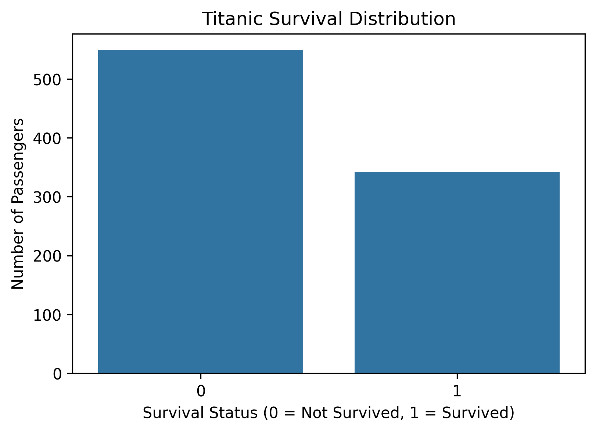
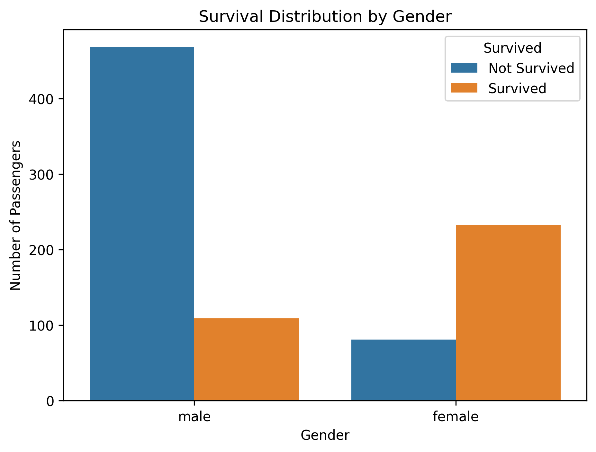
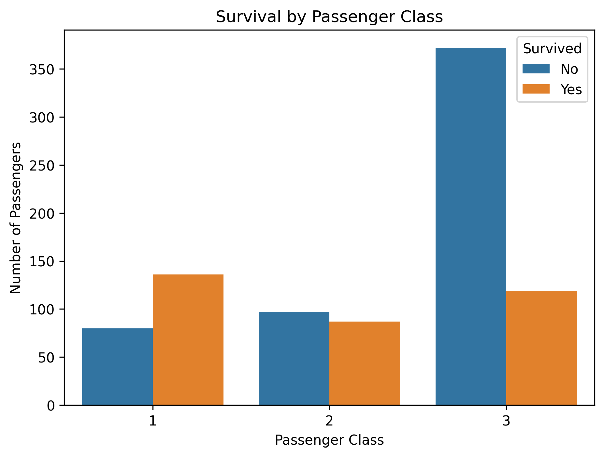
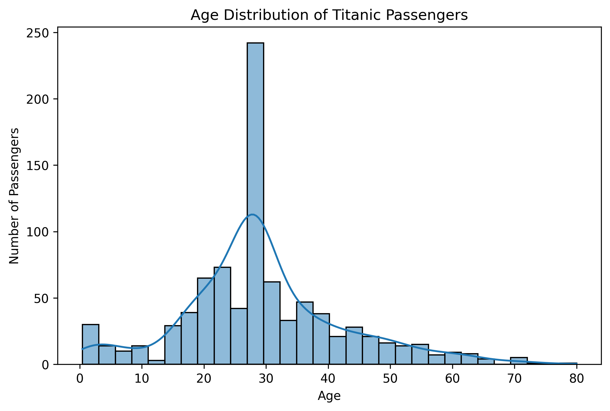
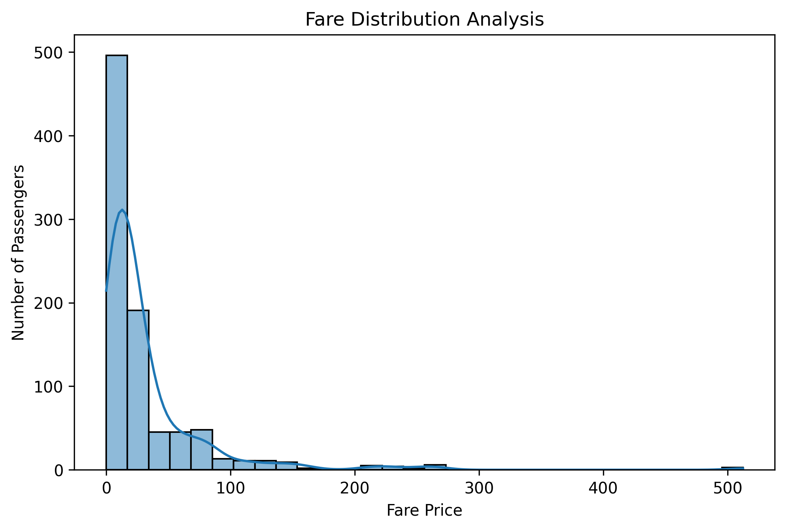
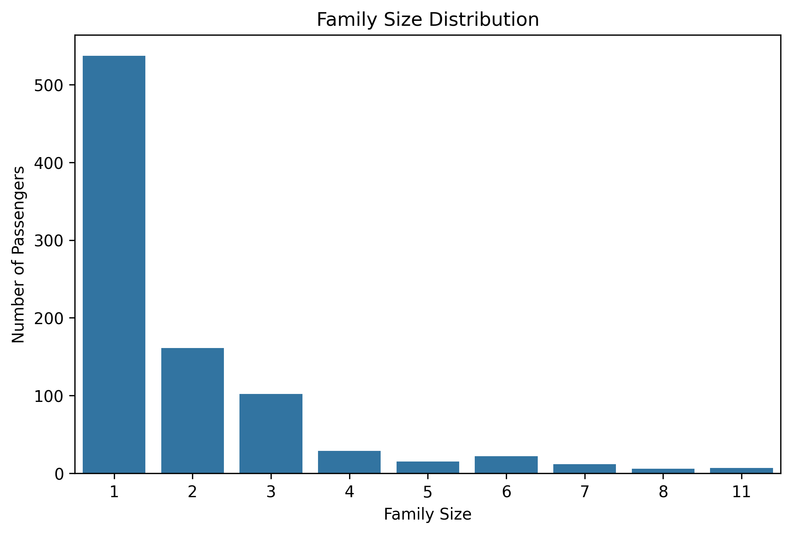
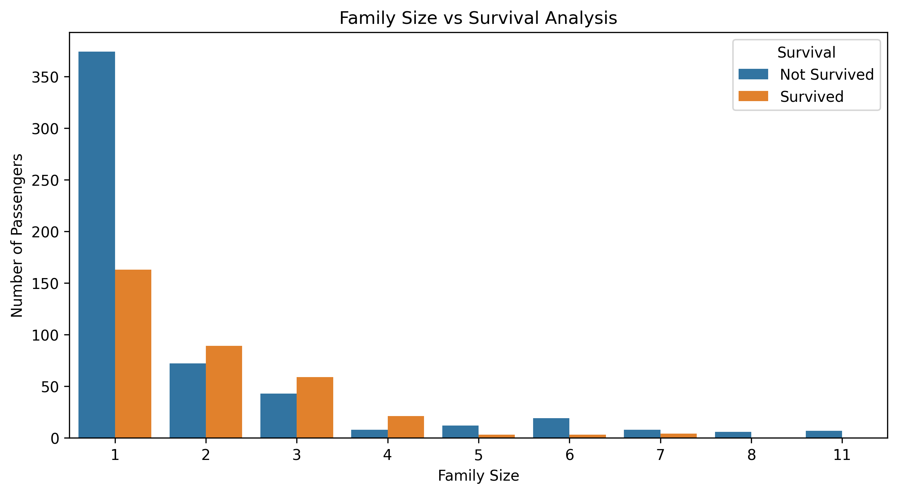
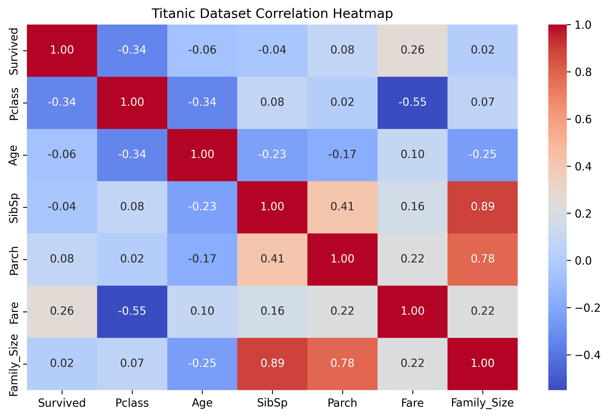

# 🚢 Titanic Survival Exploratory Data Analysis (EDA) Report

---

# 📌 Project Overview

This project performs Data Cleaning and Exploratory Data Analysis (EDA) on the Titanic passenger dataset.

The objective of this analysis is to understand the factors that influenced passenger survival during the Titanic disaster.

Using Python-based data analysis and visualization techniques, this project identifies relationships between passenger characteristics such as gender, age, passenger class, fare, and family size with survival outcomes.

---

# 🎯 Project Objectives

The main objectives of this project are:

- Perform data cleaning and preprocessing
- Handle missing values
- Analyze passenger survival patterns
- Identify important survival factors
- Create meaningful visualizations
- Generate data-driven insights from historical data

---

# 📂 Dataset Information

## Dataset Name

Titanic Dataset

## Source

Kaggle Titanic Dataset

## Dataset Size
Records: 891
Features: 12

## Features

| Feature | Description |
|---|---|
| PassengerId | Unique passenger identifier |
| Survived | Survival status |
| Pclass | Passenger class |
| Sex | Passenger gender |
| Age | Passenger age |
| SibSp | Number of siblings/spouses |
| Parch | Number of parents/children |
| Fare | Ticket fare |
| Embarked | Port of embarkation |

---

# 🛠️ Technologies Used

## Programming Language

- Python

## Libraries

| Library | Purpose |
|---|---|
| Pandas | Data manipulation |
| NumPy | Numerical analysis |
| Matplotlib | Data visualization |
| Seaborn | Statistical visualization |

## Tools

- Jupyter Notebook
- VS Code
- Git
- GitHub

---

# 🔄 Project Workflow
Dataset Collection
|
↓
Data Understanding
|
↓
Data Cleaning
|
↓
Feature Engineering
|
↓
Exploratory Data Analysis
|
↓
Visualization
|
↓
Insights Generation

---

# 🔍 Data Understanding

Initial dataset analysis showed:
Total Records: 891
Total Features: 12

Missing values detected:

- Age: 177 missing values
- Cabin: 687 missing values
- Embarked: 2 missing values

Duplicate records:
0

---

# 🧹 Data Cleaning

The following preprocessing steps were performed:

## Missing Value Handling

### Age

Missing Age values were filled using median value because age distribution contains outliers.

### Embarked

Missing Embarked values were filled using the most frequent value.

### Cabin

Cabin column was removed because it contained a large number of missing values.

---

## Duplicate Removal

Duplicate records were checked and removed.

Result:
Duplicate Records: 0

---

## Feature Selection

The following columns were retained for analysis:
Survived
Pclass
Sex
Age
SibSp
Parch
Fare
Embarked

---

# ⚙️ Feature Engineering

A new feature was created:

## Family_Size

Formula:
Family_Size = SibSp + Parch + 1

This feature helps analyze whether traveling alone or with family affected survival probability.

---

# 📊 Exploratory Data Analysis

## 1. Survival Distribution

### Analysis

This visualization shows the total number of passengers who survived and did not survive.

### Observation

- The number of non-survivors was higher than survivors.
- Survival was not equally distributed among passengers.

---

## 2. Gender Survival Analysis

### Analysis

The survival rate was compared between male and female passengers.

### Observation

- Female passengers had significantly higher survival rates.
- Gender was one of the strongest survival factors.

---

## 3. Passenger Class Analysis

### Analysis

Passenger survival was analyzed across different ticket classes.

### Observation

- First-class passengers had better survival chances.
- Third-class passengers had the highest number of deaths.

---

## 4. Age Distribution Analysis

### Analysis

Passenger age distribution was studied.

### Observation

- Most passengers were young and middle-aged adults.
- Age alone was not the strongest survival predictor.

---

## 5. Fare Distribution Analysis

### Analysis

Ticket fare distribution was analyzed.

### Observation

- Most passengers paid lower fares.
- Higher fare passengers generally belonged to higher classes.

---

## 6. Family Size Analysis

### Analysis

Family_Size was analyzed to understand the effect of traveling with family.

### Observation

- Many passengers traveled alone or with small families.
- Very large families were less common.

---

## 7. Family Size vs Survival

### Observation

- Family size showed some relationship with survival.
- Extremely large families had lower survival chances.

---

## 8. Correlation Analysis

### Analysis

A correlation heatmap was created to identify relationships between numerical variables.

### Observation

- Fare had a positive relationship with survival.
- Passenger class showed a relationship with survival.
- Age had weaker correlation compared to other variables.

---

# 💡 Key Insights

## Important Survival Factors

Based on analysis:

1. Gender was a major survival factor.
2. Passenger class influenced survival probability.
3. Higher fare passengers had better survival chances.
4. Family structure affected survival outcomes.

---

# 📈 Business/Real World Insights

Although Titanic is a historical dataset, this analysis demonstrates:

## Risk Prediction

Historical data can help identify factors affecting outcomes.

## Customer Segmentation

Passenger class and fare represent different customer groups.

## Data Driven Decision Making

EDA helps discover hidden patterns before building predictive models.

---

# 📁 Project Structure
Titanic_Survival_EDA_Analysis_week_2

│
├── data
│ ├── raw
│ │ └── titanic.csv
│ │
│ └── processed
│ └── titanic_cleaned.csv
│
├── notebooks
│ └── Titanic_EDA.ipynb
│
├── results
│ ├── survival_distribution.png
│ ├── gender_survival_analysis.png
│ ├── passenger_class_analysis.png
│ ├── age_distribution.png
│ ├── fare_distribution.png
│ ├── family_size_distribution.png
│ └── correlation_heatmap.png
│
└── reports
└── EDA_Report.md

---

# ✅ Project Completion Status

✔ Data Collection Completed  
✔ Data Understanding Completed  
✔ Data Cleaning Completed  
✔ Feature Engineering Completed  
✔ Exploratory Data Analysis Completed  
✔ Visualization Completed  
✔ Report Generation Completed  

---

# 👨‍💻 Author

**SIDDIQUE H**

Data Analytics | Python | Machine Learning | Generative AI